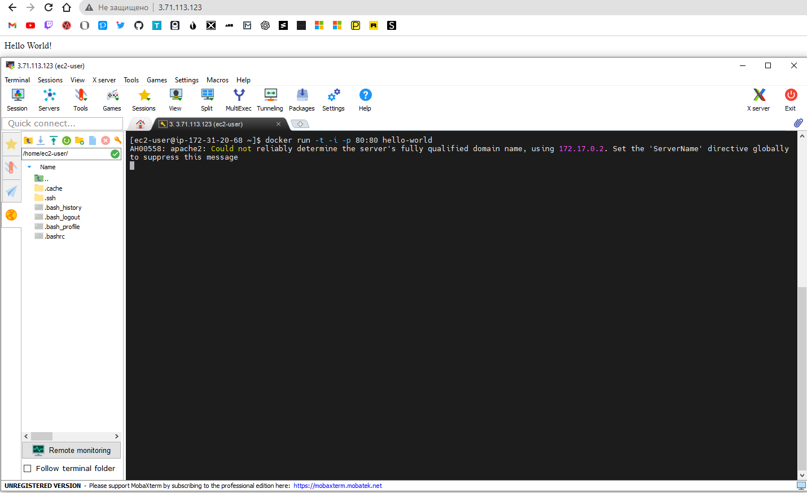
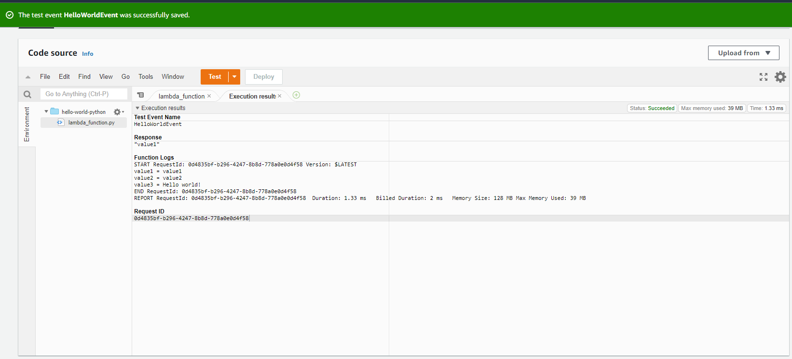

# Task 2.2 Virtualization and Cloud Basic
## Instance with ssh connection:

___
## Snapshot of my instance:

___
## Created adn attached new volume:

___
## Some file inside nwe volume:

___
## Second instance from backup:

___
## Detached volume from the first instance and atached to the second:

___
## Wordpress website via Amazon lightsail:

___
## S3 with some content inside:

___
## New IAM role:

___
## New contet loaded with CLI:

___
## Docker container part:

___
## Lambda part: 

___
## Own website with S3. You can check it by this link - http://epam-task.pp.ua.s3-website.eu-central-1.amazonaws.com/

