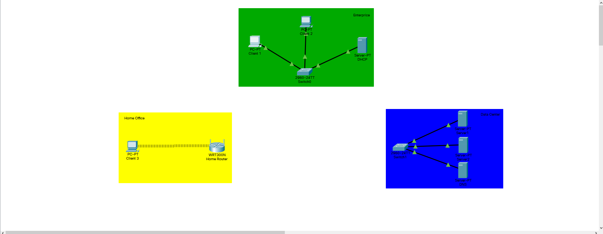

# Module - Networking fundamentals. Task 3
## Created a network by example:

___
## Checking connection between computers:

___
## Checking connection  between servers:

___
## Changed Ethernet modul to WI-FI:

___
## Checking connection:

___