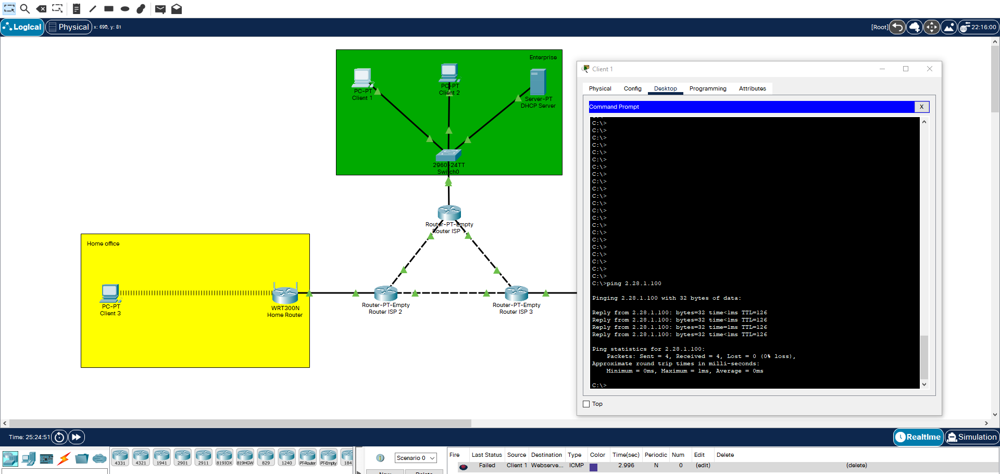
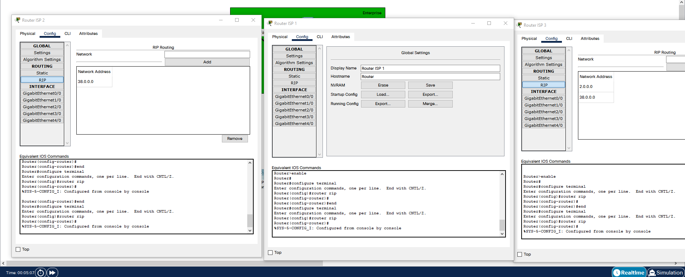
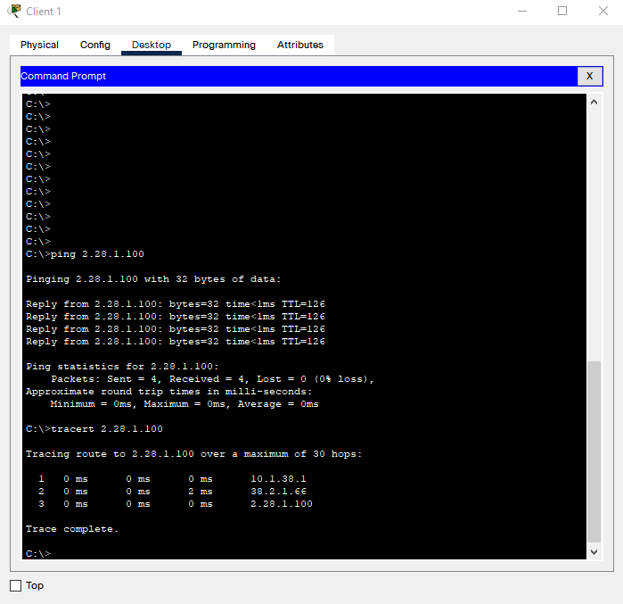

# Module - Networking fundamentals. Task 3.3
## Checking connection between Client 1 and Web server 2 after config routing tables:

___
## Dynemic routing settings:

___
## Connection adn tracert check:
