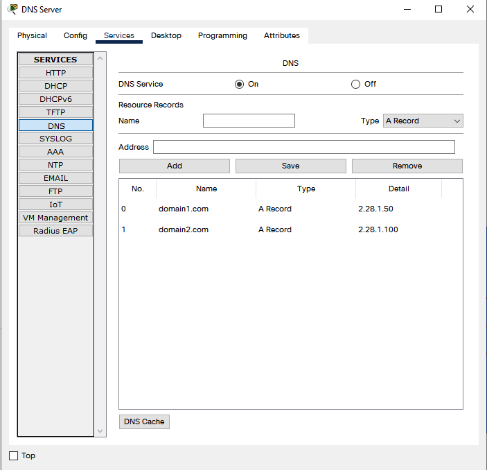

# Module - Networking fundamentals. Task 3.4
## DHCP settings and checking changes on computers:

___
## Home router DHCP settings:

___
## Domain settings:

___
## Test domain 1 and domain 2 connection:
