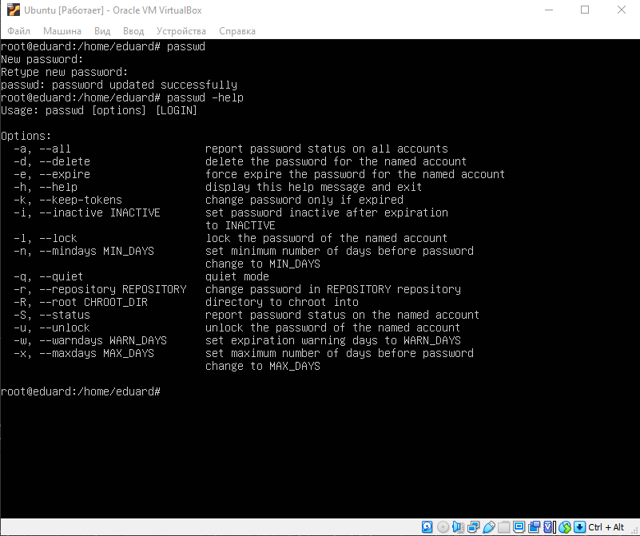

# Task 4.1

## Part №1

### Log in to the system as root and examine the basic parameters of the passwd command:

___
### Traditionally, the /etc/passwd file stores information about all registered users who have access to the system.

The /etc/passwd file contains the following entries separated by colons:
- Username
- Encrypted password
- User Numeric Identifier (UID)
- User group numeric identifier (GID)
- Full username (GECOS)
- User home directory
- Login shell
___
### Determine  the  users  registered  in  the  system,  as  well  as what  commands  they execute:

___
### Change personal information about yourself:

___
### Define and describe any two keys for these commands. Give examples:
- sudo chfn -w 1234567890 eduard - change work phone number.
- sudo chfn -h 0987654321 eduard - change home phone number.
___
### Explore the more and less commands using the help system. View the contents of files .bash* using commands:
### more coomand usage example:

___
### less command usage example:

___
### List the contents of the home directory using the ls command, define its files and  directories:

___
## Part №2

###  Examine  the tree command.  Master  the  technique  of  applying  a  template,  for example, display all files that contain a character c, or files that contain a specific sequence of characters:

___
### The file type can be determined using the file command. Usage example:

___
### From anywhere you can return to your home directory using the cd command.
___
### ls -a lists all files, including hidden ones. ls -l print a verbose list showing owner, group, creation date, size...

___
### Perform the followingsequence of operations:-create a subdirectory in the home directory;-in this subdirectory create a file containing information about directories located in the root directory (using I/O redirection operations);-view the created file;-copy the created file to your home directory using relative and absolute addressing.-delete the previously created subdirectory with the file requesting removal; delete the file copied to the home directory:

___
###  Perform the following sequence of operations:-createa subdirectory test in the home directory;-copy  the .bash_history file  to  this  directory  while  changing  its  name  tolabwork2;-create a hard and soft link to the labwork2 file in the test subdirectory;-how to define soft and hard link, what do theseconcepts;-change the data by opening a symbolic link. What changes will happen andwhy-rename the hard link file to hard_lnk_labwork2;-rename the soft link file to symb_lnk_labwork2 file;-then delete the labwork2. What changes have occurred and why?

### The main difference between a hard link and a soft link is that the soft link relies on the file name. And the hard one points to the physical location, determined by the descriptor where the file is located.
### If we change the information in the soft link, then these changes will be transferred to the original file.
### If you move or delete the original file or directory, any existing symlinks pointing to it will be broken.
___
### Using  the  locate  utility,  find  all  files  that  contain  the  squid  and  traceroutesequence:

___
 ### Determine  which  partitions  are  mounted  in  the  system,  as  well  as  the  types  ofthese partitions. Count the number of lines containing a given sequence of characters in a givenfile: 
 
 ___
 ### Using the find command, find all files in the /etc directory containing thehost character sequence: 
 
 __
 ### List all objects in /etc that contain the ss character sequence. How can Iduplicate a similar command using a bunch of grep?
 
 ### With grep:
 
 ___
 ### Organize a screen-by-screen print of the contents of the /etc directory:
 ### cat /etc/* | less: 
 
 ___
 ### The Linux kernel implements support for two types of devices - character and block.
 ### Notice the very first character on each line. It specifies the device type. The symbol "b" denotes linux block devices (block), and the symbol "c" denotes character devices (character):
 
 ___
 ### The file type can be determined using the file command. On linux, there are regular files, directories, symbolic links, block devices, character devices, sockets, pipes.
 ___
 ### List the first 5 directory files that were recently accessed in the /etcdirectory:
 

