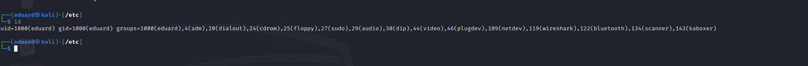
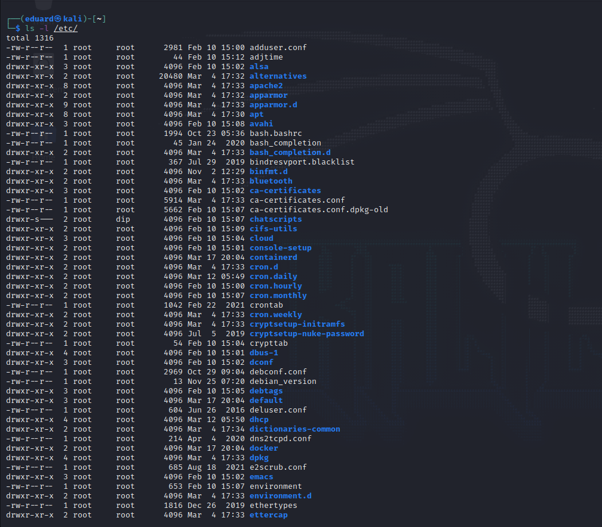

# Task 4.2

## 1) etc/paswd

### The /etc/passwd file contains a list of users known to the system. During the user registration process, the system accesses this file looking for the user's ID and home directory.

### Each line of the file describes one user and 7 fields separated by colons:
  - Registration names must be unique and contain no more than 32 characters.
They can contain any characters except colon and newline. They must not start with a number.
  - Encrypted password or "filler" password. This field may contain:
  > character "x" -- so indicate that the password is stored in the file /etc/shadow

  > character "*" -- means that this account is temporarily disabled.

  > or a set of random characters and numbers -- means the user's direct password is specified in encrypted form.
  ___

  ## etc/group

  ### The /etc/group file contains the names of the groups that are present on the Linux operating system and lists the members of each group.

  ### Each entry in the /etc/group file represents one group and contains 4 fields:

  - Group name. By default, when a new user is created, its group is also created with the same name as the user's login name.
  - Encrypted password or x character indicating use of the /etc/gshadow file;
  - Group ID. (number)
  - List of members separated by commas without spaces.
  ___
  ## 2) UID

  ### The UID is used to identify the user on the system and to determine which system resources the user can access.

  ### The set of valid UID values ​​varies by system; in general, UID allows values ​​from 0 to 65535 with some caveats:

  - The superuser must always have a UID of zero (0).
  - The nobody user is usually assigned either the highest possible UID (as opposed to the superuser) or one of the system UIDs.
  - UIDs from 1 to 100 are reserved by agreement for system needs; some guides recommend reserving UIDs from 101 to 499 (on Red Hat) or even 999 (on Debian)

  ###  You can always rely on the /etc/passwd file to get the user's UID. This is not the only way to get UID information on Linux. The Linux id command will display the UID, GID, and groups your current user belongs to:
  
  ___
  ## 3) GID

  ### In addition to the user ID, the account has a group ID associated with it. User groups are used to organize access of several users to some resources. The group, like the user, has a name and an identification number - GID (Group ID)

  ### You can check GID with id command. 
  
  ___
  ## 4) To determine if a user belongs to a group, you can use 2 commands - id and group with various additional options for more information. Here you can see examples of using id and group command: 
  
  ___
  ## 5) To add a user, there are commands such as adduser and useradd.
  - useradd is a low-level utility for creating users in Linux.
  - adduser is a simpler solution for creating users and is in fact an add-on for useradd, groupadd and usermod.
  - 
  ###  To create a full-fledged user, you will need to make such parameters with the -d flag to specify the home directory for the new user, using the -R flag, we change the access rights to the directory and also set the password for the user using the passwd command

  ## 6) To rename a user, use the usermod command with the following syntax:
      usermod -l new_user opd_user
___
## 7) skell_dir - The directory of files to use for the newly created custom directory.
___
## 8) To completely delete a user and all his data from the system, you need to execute the following command:
    deluser -frZ user_name 
___
## 9) To block a user, run the following command:
    usermod -L username
### To unblock a user run the following command:
    usermod -U username
___
## 10) To remove a password from a user, use the following command:
    sudo passwd -d username
___
## 11) To view extended information about a directory, use the command ls -l

### In the description of each file, the first character indicates the type of file object, followed by permissions (rwxrwxrwx). The second column contains a number indicating the number of hard links for the files. Next are the owner, group, size, last modified date, and file name. The size is in bytes, but you can get a more readable format with the -h switch.
___
## 12) Basic File Permissions in Linux:
### Each file has three access options:
- Reading - allows you to get the contents of the file, but not for writing. For a directory, allows you to get a list of files and directories located in it;
- Write - allows you to write new data to a file or change existing ones, and also allows you to create and modify files and directories;
- Execution - You cannot execute a program if it does not have the execute flag. This attribute is set for all programs and scripts, it is with the help of it that the system can understand that this file needs to be run as a program.
### Each file has three categories of users for which you can set different combinations of access rights:
- Owner - a set of rights for the owner of the file, the user who created it or is currently set as its owner. Usually the owner has all rights, read, write and execute.
- Group - any user group that exists in the system and is associated with the file. However, this can only be one group, and is usually the owner's group, although a different group can be assigned to the file.
- The rest are all users, except for the owner and users who are members of the file's group.
## Special file permissions in Linux:
### In order to allow ordinary users to execute programs on behalf of the superuser without knowing his password, such a thing as SUID and SGID bits was invented.
- SUID - if this bit is set, then when the program is executed, the id of the user from which it was launched is replaced by the id of the file owner. In effect, this allows normal users to run programs as root;
- SGID - This flag works in a similar way, only the difference is that the user is considered a member of the group the file is associated with, not the groups to which he actually belongs. If the SGID flag is set on a directory, all files created in it will be associated with the group of the directory, not the user. This behavior is used to organize public folders;
- Sticky-bit - This bit is also used to create shared folders. If set, users can only create, read, and execute files, but cannot delete files owned by other users.
___
## 14) Changing the owner of a file is done with the chown command, and changing file permissions with the chmod command.
### Change owner example:
      sudo chown username /Documents/
### Change permission example: 
      chmod ugo+rwx filename
### Last example describe full acces to file ror all users.
___ 
## 15)
| octal representation | acces rigths |
|:--------------------:|:------------:| 
|0                     |---           |
|1                     |--x           |
|2                     |-w-           |
|3                     |-wx           |
|4                     |r--           |
|5                     |r-x           |
|6                     |rw-           |
|7                     |rwx           |
___
### The umask command defines the bitmask that will be applied to new files.
___
## 16)
___
## 17)
___
