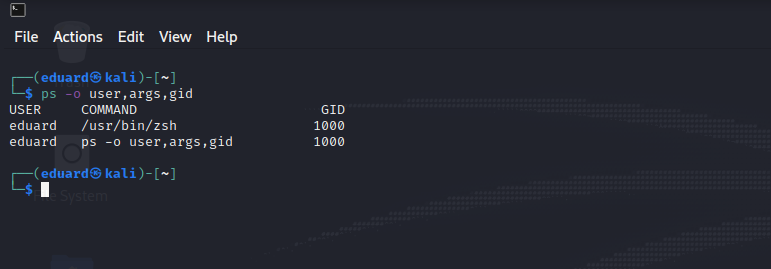
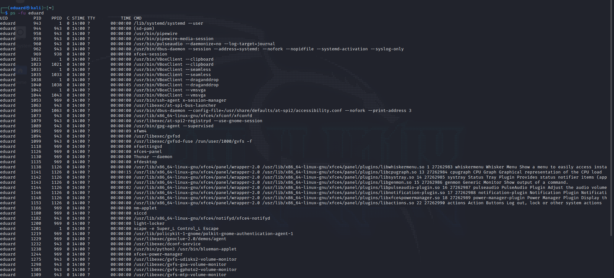

# Task №3

## Part №1
___

## 1)
### Of the main types of process states, one can distinguish the:
- execution state
- the waiting state
- ready state
___
## 2)
### Examine the pstree command. Make output (highlight) the chain (ancestors) of the currentprocess.

___
## 3)
### using the proc file system, users can get information about the state of the computer and the kernel.

___
## 4)
### Print information about the processor:

___
## 5)
###  Use the ps command to get information about the process. The information should be asfollows: the owner of the process, the arguments with which the process was launched forexecution, the group owner of this process, etc:

___
## 6)
### The linux kernel processes are obtained by the result itself, while the consequence of their occurrence occurs, the kthread process occurs, with PID=2. Thus, the process of addressing the kernel should be considered a process itself with PID=2, and also a process with a PPID (i.e. parent pid) equal to 2.
___
## 7)

___
## 8)

___
## 9)
### Based on the recommendations of the ps command documentation, we can conclude that the utilities for analyzing running tasks are - top. There is also a more advanced version - htop, pgrep, pstree, proc
___
## 10)
### Top (table of processes) is a console command that displays a list of processes running in the system and information about them. By default, it sorts them in real time by CPU load.
___
## 11)

___
## 12
### Inerractive commands:
    h - output help on the utility;
    q or Esc - exit from the top;
    A - choice of color scheme;
    d or s - change the interval for updating information;
    H - output process flows;
    k - send a signal about the end of the process;
    W - Save the current program settings to a configuration file;
    Y - view additional information about the process, open files, ports, logs, etc.;
    Z - change color scheme;
    l - hide or lead to a high load on the system;
    m - turn off or switch the mode of displaying information about the memory;
    x - highlight with a bold column, which highlights high sorting;
    y - is isolated by fatty processes that are currently being released;
    z - switching between color and single color modes;
    c - switch command output mode, available full path and command only;
    F - setting fields with information about processes;
    o - filtering the results when the condition is reached;
    u - filtering processes by username;
    V - processor files in the form of a tree;
    i - switching the display of processes that are not currently used by processor resources;
    n - the maximum number of processes to display in the program;
    L - search by word;
    <> - shift the sort field to the right and left;
___
## 13)
### Sort the contents of the processes window using various parameters (for example, theamount of processor time taken up, etc.):

___
## 14)
### To set process priority, use the nice and renice commands.
___
## 15)
### You can change the priority of the process directly in the top utility by pressing the r key and specifying the PID and specifying the value of the new priority for the process.
___
## 16)
### kill - send signals to processes:
> kill [-s signal_name] pid ...

> kill -l [exitcode]

> kill -signal_name pid ...

> kill -signal_number pid ...

### Below are the most commonly used signals, it makes sense:
> HUP (hang up)

> INT (interrupt)

> 3QUIT (quit)

> 6ABRT (abort)

> 9KILL (non-catchable, non-ignorable kill)

> 14ALRM (alarm clock)

> 15TERM (software termination signal)
___
## 17)
### The jobs command in Linux allows the user to directly interact with processes in the current shell. Jobs have three possible states in Linux: foreground, background, and stopped.

### fg - a command to resume the task and transfer control to it in command shells. The command allows you to resume a suspended process or take it out of the background.

### The bg command is designed to resume the execution of a stopped task in the background in command shells.

### The purpose of Nohup is to intercept and prevent SIGHUP signals from reaching the command.
___

## Part №2
___

## 1)
___
## 2)
___
## 3)
___
## 4)
___
## 5)