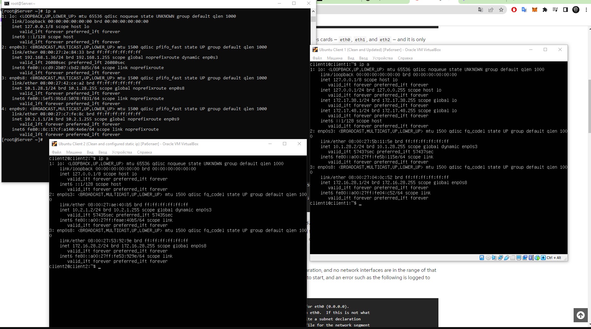

# Task 5 Linux Networking

## 1) 
### Static and DHCP network settings result:

___
## 2)
### DHCP configuration file:

___
## 3)
### Connection check with clients from server:

___
## 4)
### Routing settings:

___
## 5)
### Connection check between clients:

___
## 6)
### SSH connection from client 1 to client 2:

### SSH connection from client 2 to client 1:

### SSH connection from client 1 to server:

### SSH connection from client 2 to server:

___
## 7)
### Iptable configuratin:
        iptables -I INPUT -s 10.1.28.0/24 -p tcp --dport ssh -j REJECT

___
## 8)
___