# Task 7

### Checking instalation progress of MySQL:
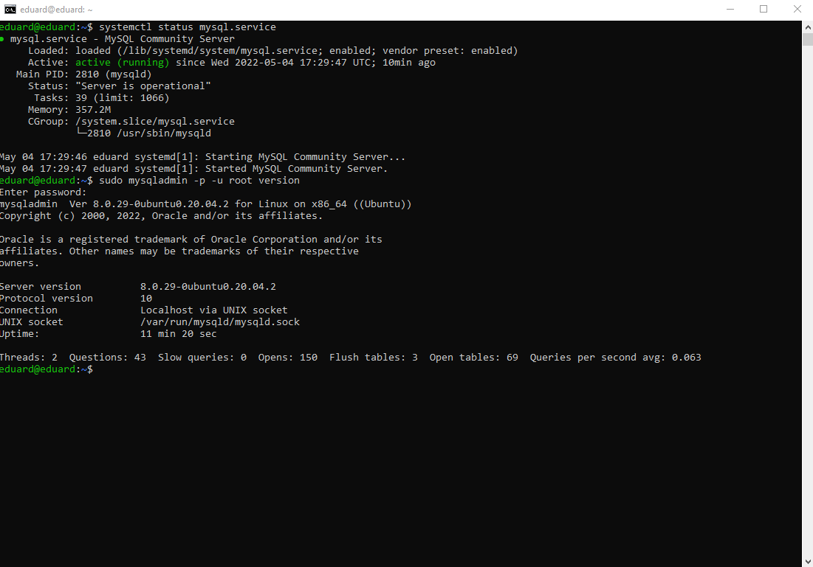 
___
### Creating database with 3 tables:
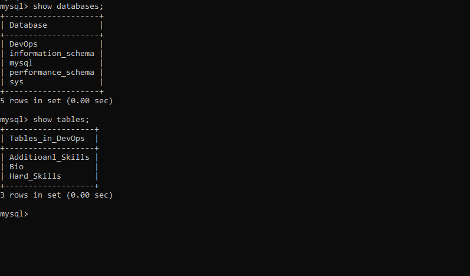
___
### Inside tables:
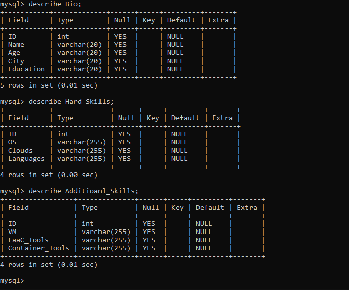
___
### More details about tables:
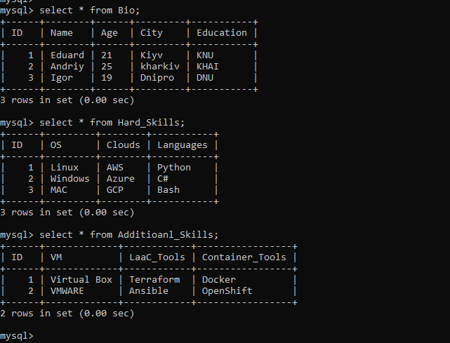
___
### Using the SELECT command with different parameters:
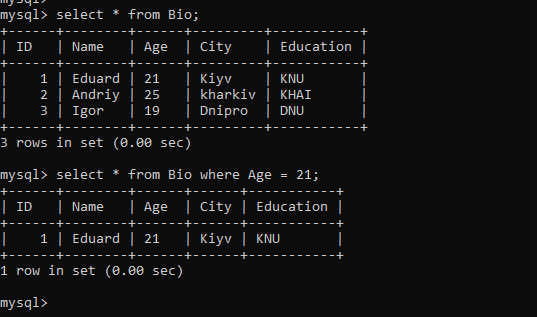
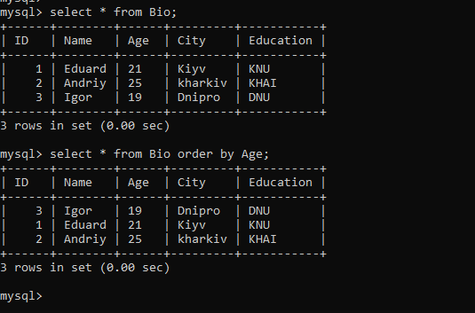
___
### DDL commands usage example:
    create table New_Table (ID INt, First VARCHAR(20), Second VARCHAR(20));
___
### DML commands usage example:
     insert into Additioanl_Skills (ID, VM, LaaC_Tools, Container_Tools) VALUES ("2", "VMWARE", "Ansible", "OpenShift");
___
### DCL commands usage example:
    grant all privileges on DevOps.* to 'new_user'@'localhost';
___
### Creating a new user and cheking new user:
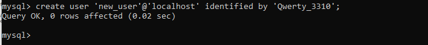
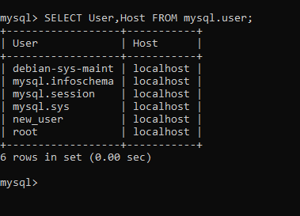
___
### Login and test permissions of new user:
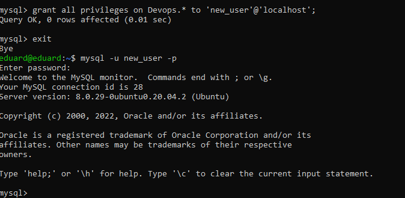
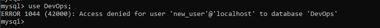
___
### Give a new privileges to a new user and test:
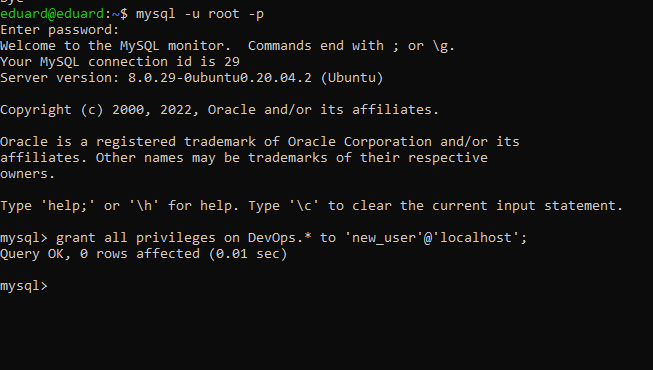
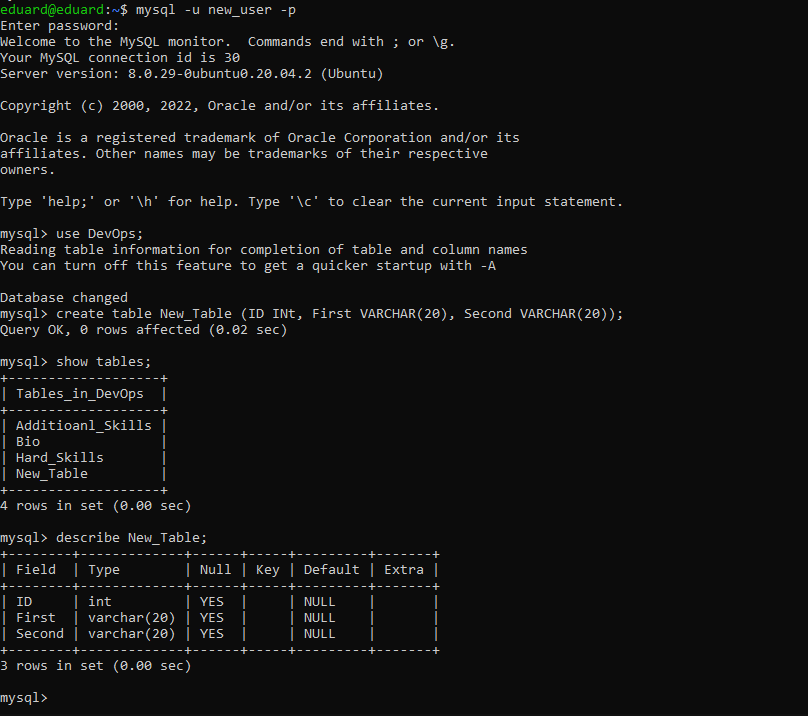