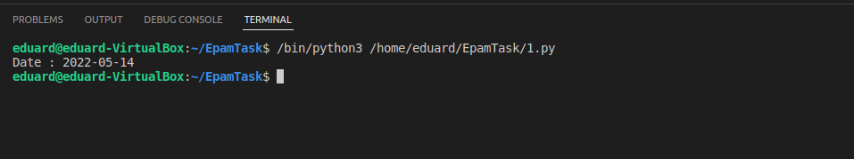
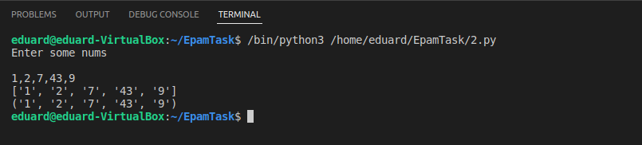
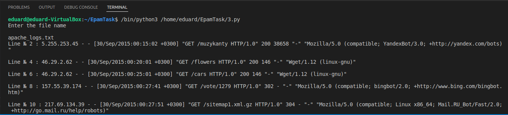
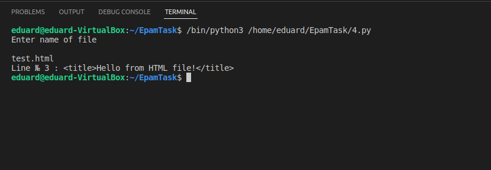
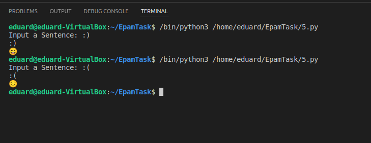
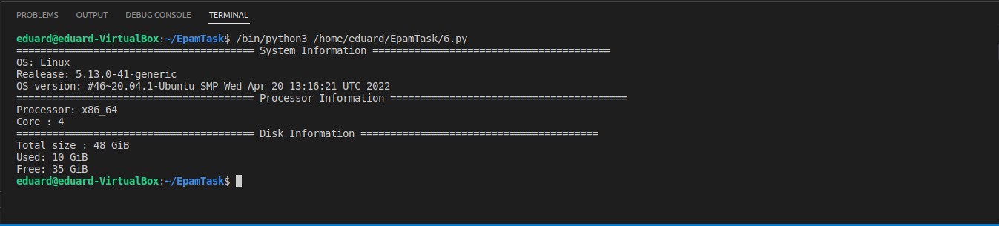

# Python task

### 1) Write a simple program that will display the current date and time.

___
### 2) Write a python program that will accept numbers separated by commas and then must write a tuple and a list of them:

___
### 3) Write a program in python that asks for the name of the file. The file must be read, and only even-numbered lines must be shown:

___
### 4) Write python program, which should read htmldocument, parse it, and showit’s title:

___
### 5) Write pythonprogram, which will parse user’s text, and replace some emotions with emoji’s:

___
### 6) Write a program that will show basic information about the computer (OS, amount of RAM, HDD, etc.):
