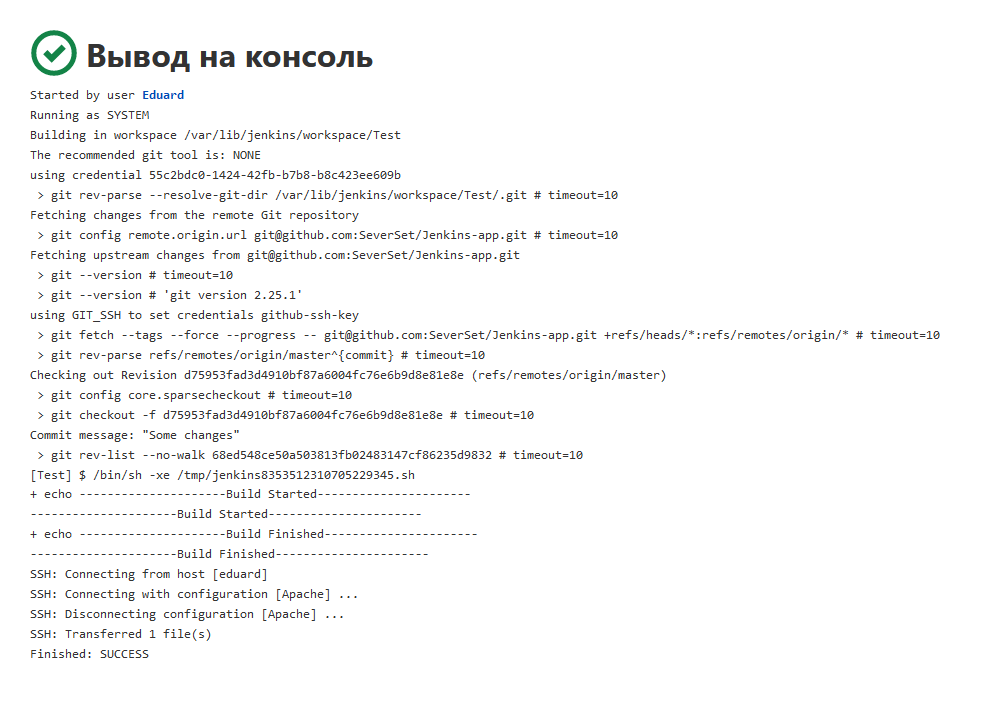

# Jenkins task

### Jenkins instalation:

- Java: 
  > sudo apt update

  > sudo apt install openjdk-11-jre

- Jenkins:
  > curl -fsSL https://pkg.jenkins.io/debian-stable/jenkins.io.key | sudo tee \
  /usr/share/keyrings/jenkins-keyring.asc > /dev/null

  > echo deb [signed-by=/usr/share/keyrings/jenkins-keyring.asc] \
  https://pkg.jenkins.io/debian-stable binary/ | sudo tee \
  /etc/apt/sources.list.d/jenkins.list > /dev/null

  > sudo apt-get update

  > sudo apt-get install jenkins
___
### Jenkins instalation result:

___
### Checking working by IP:

___
### Jenkins welcome page:

___
### The Jenkins job result:

___
### Simple job example in Jenkins with deploy:

___
### Simple job example in Jenkins with deploy using plugin:

___
### Simple CI/CD pipeline example:

